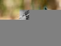
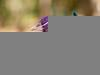
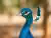
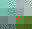
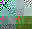
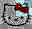
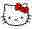

# JPEG Images

`script/confirm-matches-djpeg.sh test/3pdata/blinksuite | grep Differ` gives 5
test files for which Wuffs' `example/convert-to-nia` and libjpeg-turbo's
`djpeg` do not match:

```
Differ (other)  test/3pdata/blinksuite/182.jpg
Differ (large)  test/3pdata/blinksuite/large-size-image-crash.jpeg
Differ (trunc)  test/3pdata/blinksuite/missing-eoi.jpg
Differ (trunc)  test/3pdata/blinksuite/non-interleaved_progressive-1.jpg
Differ (trunc)  test/3pdata/blinksuite/non-interleaved_progressive.jpg
```

We'll discuss these in simple to complex order, which happens to be the
opposite of the alphabetical order they're listed above.

---

The last three are truncated JPEG files. Like most image file format
specifications, the JPEG specification doesn't mandate exactly how to decode
*invalid* input (including truncated input), and it's reasonable for Wuffs and
libjpeg-turbo to produce slightly different outputs here. Wuffs' [commit
a3cecef6](https://github.com/google/wuffs/commit/a3cecef69aa04f1145f0c84b92481e8abd51c2c3)
"std/jpeg: decode truncated JPEGs on MCU boundaries" discusses some of the
performance trade-offs if Wuffs were to try to exactly match on all input, not
just on well-formed JPEGs.

As pointed out by the a3cecef6 commit message, matching libjpeg-turbo exactly
doesn't necessarily give better output. Here's two JPEG images (one sequential,
one progressive, both truncated to 1 KiB) decoded by Wuffs:




Here's the same input, this time decoded by libjpeg-turbo:




Zoom in on all four images (in four different tabs, if viewing in a browser),
and the first pair isn't obviously better or worse than the second pair.

---

`test/3pdata/blinksuite/large-size-image-crash.jpeg` is simply a very large
image (in terms of pixels: 48010 × 16173), even though the file itself is
merely 347 bytes. At 4 bytes per pixel, 48010 × 16173 × 4 ≈ 2962 MiB exceeds
`example/convert-to-nia` maximum pixel buffer size.

```
$ file test/3pdata/blinksuite/large-size-image-crash.jpeg
test/3pdata/blinksuite/large-size-image-crash.jpeg: JPEG image data, JFIF standard 1.01, aspect ratio, density 1x1, segment length 16, baseline, precision 8, 48010x16173, components 3

$ grep define.PIXBUF_ARRAY_SIZE example/convert-to-nia/convert-to-nia.c
#define PIXBUF_ARRAY_SIZE (256 * 1024 * 1024)
```

The file itself is merely 347 bytes long. Even if we patched
`example/convert-to-nia` to allow larger pixel buffers, it's a truncated image
like the first three we discussed, above.

```
$ djpeg test/3pdata/blinksuite/large-size-image-crash.jpeg > /dev/null
Premature end of JPEG file
```

That file is in the test suite presumably to check that decoders don't crash or
trigger buffer overflows, and `example/convert-to-nia` does neither here.

---

`test/3pdata/blinksuite/182.jpg` is our final example (first in alphabetical
order but last in discussion order) of where Wuffs and libjpeg-turbo differ.

Once again, different JPEG implementations have some leeway on how to treat
*invalid* JPEGs, and this JPEG is invalid.

```
$ djpeg test/3pdata/blinksuite/182.jpg > /dev/null
Corrupt JPEG data: 29 extraneous bytes before marker 0xc4
```

As of Wuffs' [commit
186bdc5f](https://github.com/google/wuffs/commit/186bdc5fe2eedaa2869123aa7954ed9a4582e895)
"Roll back 'decode truncated... on MCU boundaries'" and libjpeg-turbo v3.0.1,
here are the two decodings (Wuffs' and djpeg's):




When zooming in, the two are indeed different, but both decodings look like
garbage and it's not clear that one is better than the other (although djpeg's
output seems to have more 'detail' that Wuffs' output is missing).

Let's look at the hex dump of the `test/3pdata/blinksuite/182.jpg` file, copied
into this repo as `test/3pdata/asset/182.0-original.jpg`

```
$ hd test/3pdata/asset/182.0-original.jpg
00000000  ff d8 ff e0 00 10 4a 46  49 46 00 01 01 01 00 48  |......JFIF.....H|
00000010  00 48 00 00 ff db 00 43  00 10 0b 0c 0e 0c 0a 10  |.H.....C........|
00000020  0e 0d 0e 12 11 10 13 18  28 1a 18 16 16 18 31 23  |........(.....1#|
00000030  25 1d 28 3a 33 3d 3c 39  33 38 37 40 48 5c 4e 40  |%.(:3=<9387@H\N@|
00000040  44 57 45 37 38 50 6d 51  57 5f 62 67 68 67 3e 4d  |DWE78PmQW_bghg>M|
00000050  71 79 70 64 78 5c 65 67  63 ff db 00 43 01 11 12  |qypdx\egc...C...|
00000060  12 18 15 18 2f 1a 1a 2f  63 42 38 42 63 63 63 63  |..../../cB8Bcccc|
00000070  63 63 63 63 63 63 63 63  63 63 63 63 63 63 63 63  |cccccccccccccccc|
*
00000090  63 63 63 63 63 63 63 63  63 63 63 63 63 63 ff c0  |cccccccccccccc..|
000000a0  00 11 08 00 1d 00 20 03  01 22 00 02 11 01 03 11  |...... .."......|
000000b0  01 ff c4 00 18 00 00 03  01 01 00 00 00 00 00 00  |................|
000000c0  00 00 00 00 00 00 02 03  04 05 01 ff c4 00 16 01  |................|
000000d0  01 01 01 00 00 00 00 00  00 00 00 00 00 00 00 00  |................|
000000e0  00 02 03 fe da 00 0c 03  01 00 02 10 03 10 00 00  |................|
000000f0  01 d9 02 69 93 7c 61 3a  d3 4b 91 59 76 77 50 7f  |...i.|a:.K.YvwP.|
00000100  ff c4 00 1e 10 00 02 01  05 00 03 00 00 00 00 00  |................|
00000110  00 00 00 00 00 01 02 03  00 04 11 12 13 10 22 31  |.............."1|
00000120  ff da 00 08 01 01 00 01  05 02 66 21 8c 85 55 2f  |..........f!..U/|
00000130  09 68 df 63 f6 62 36 57  b3 5c 5b 27 19 5b 11 ce  |.h.c.b6W.\['.[..|
00000140  06 a9 ae 40 f7 9a b9 25  72 4f 1f ff c4 00 19 11  |...@...%rO......|
00000150  00 01 05 00 00 00 00 00  00 00 00 00 00 00 00 00  |................|
00000160  01 00 02 10 12 21 ff da  00 08 01 03 01 01 3f 01  |.....!........?.|
00000170  4e a1 d1 3f ff c4 00 17  11 00 03 01 00 00 00 00  |N..?............|
00000180  00 00 00 00 00 00 00 00  00 00 01 10 11 ff da 00  |................|
00000190  08 01 02 01 01 3f 01 16  df ff c4 00 23 10 00 01  |.....?......#...|
000001a0  03 02 05 05 00 00 00 00  00 00 00 00 00 00 01 00  |................|
000001b0  11 21 02 71 10 12 22 41  51 03 31 32 61 62 ff da  |.!.q.."AQ.12ab..|
000001c0  00 08 01 01 00 06 3f 02  14 d2 1c 9e 4a 24 f4 ea  |......?.....J$..|
000001d0  8b 26 a8 52 15 41 e9 2d  c2 1f 21 10 7b 15 a0 b1  |.&.R.A.-..!.{...|
000001e0  f6 b5 90 e4 44 ac cd 1b  ad 25 ee 86 63 22 61 66  |....D....%..c"af|
000001f0  1e 22 1f 63 84 06 b1 65  21 ee 5f 0f ff c4 00 23  |.".c...e!._....#|
00000200  10 01 00 02 01 03 02 07  00 00 00 00 00 00 00 00  |................|
00000210  00 01 00 11 21 31 41 71  b1 d1 10 51 61 81 a1 f0  |....!1Aq...Qa...|
00000220  f1 ff da 00 08 01 01 00  01 3f 21 28 00 5d 0c 15  |.........?!(.]..|
00000230  de 08 25 2d a7 ba 66 38  d1 ba 0e 60 dc 5d f2 9f  |..%-..f8...`.]..|
00000240  43 9f c8 60 ac 29 8e c8  f7 17 16 a2 7c 92 51 55  |C..`.)......|.QU|
00000250  62 a8 5a 7a ae db c7 42  da a8 bb d6 2a f8 26 a5  |b.Zz...B....*.&.|
00000260  13 76 68 00 3e 67 4f 0c  d9 39 dd 13 36 4e 77 54  |.vh.>gO..9..6NwT|
00000270  31 a4 ff da 00 0c 03 01  00 02 00 03 00 00 00 10  |1...............|
00000280  41 c3 28 ff c4 00 18 11  01 00 03 01 00 00 00 00  |A.(.............|
00000290  00 00 00 00 00 00 00 00  01 00 10 11 61 ff da 00  |............a...|
000002a0  08 01 03 01 01 3f 10 80  95 ce 5f ff c4 00 18 11  |.....?...._.....|
000002b0  00 02 03 00 00 00 00 00  00 00 00 00 00 00 00 00  |................|
000002c0  00 01 10 11 21 ff da 00  08 01 02 01 01 3f 10 29  |....!........?.)|
000002d0  c7 3f fe c4 00 22 10 01  01 00 02 01 03 04 03 00  |.?..."..........|
000002e0  00 00 00 00 00 00 00 01  11 00 21 41 31 61 71 10  |..........!A1aq.|
000002f0  51 81 91 a1 b1 f0 ff da  00 08 01 01 00 01 3f 10  |Q.............?.|
00000300  db 2f 88 48 1d 83 ba 38  c3 8a 32 a0 00 aa 28 b8  |./.H...8..2...(.|
00000310  dc 83 de bb 15 bb e7 59  72 c8 db a8 9c 95 8d 13  |.......Yr.......|
00000320  2f 6a 51 63 2d c0 f1 bf  e3 2d 98 0a ca 24 71 35  |/jQc-....-...$q5|
00000330  70 8b a3 d8 76 f3 fb c5  8f d0 00 f4 16 fd 93 e7  |p...v...........|
00000340  0f 59 3c 5d 9d 21 82 a3  fb 49 0a 23 cd ac a7 1b  |.Y<].!...I.#....|
00000350  d6 49 65 a5 91 38 7b 76  c5 aa 60 a8 1a 3b 4b c0  |.Ie..8{v..`..;K.|
00000360  bd 2d 2f a6 e6 cf a8 7b  f0 8c 5c 78 f3 fe 93 80  |.-/....{..\x....|
00000370  00 00 34 1e d9 ff d9                              |..4....|
00000377
```

The JPEG markers within this (including a corrupted one) are:

```
pos = 0x00000000 =          0    marker = 0xFF 0xD8  SOI
pos = 0x00000002 =          2    marker = 0xFF 0xE0  APP0
pos = 0x00000014 =         20    marker = 0xFF 0xDB  DQT
pos = 0x00000059 =         89    marker = 0xFF 0xDB  DQT
pos = 0x0000009E =        158    marker = 0xFF 0xC0  SOF0 (Sequential/Baseline)
pos = 0x000000B1 =        177    marker = 0xFF 0xC4  DHT
pos = 0x000000CB =        203    marker = 0xFF 0xC4  DHT
pos = 0x000000E3 =        227    marker = 0xFE 0xDA  SOS   *** corrupted ***
pos = 0x00000100 =        256    marker = 0xFF 0xC4  DHT
pos = 0x00000120 =        288    marker = 0xFF 0xDA  SOS
pos = 0x0000014B =        331    marker = 0xFF 0xC4  DHT
pos = 0x00000166 =        358    marker = 0xFF 0xDA  SOS
pos = 0x00000174 =        372    marker = 0xFF 0xC4  DHT
pos = 0x0000018D =        397    marker = 0xFF 0xDA  SOS
pos = 0x00000199 =        409    marker = 0xFF 0xC4  DHT
pos = 0x000001BE =        446    marker = 0xFF 0xDA  SOS
pos = 0x000001FC =        508    marker = 0xFF 0xC4  DHT
pos = 0x00000221 =        545    marker = 0xFF 0xDA  SOS
pos = 0x00000272 =        626    marker = 0xFF 0xDA  SOS
pos = 0x00000283 =        643    marker = 0xFF 0xC4  DHT
pos = 0x0000029D =        669    marker = 0xFF 0xDA  SOS
pos = 0x000002AB =        683    marker = 0xFF 0xC4  DHT
pos = 0x000002C5 =        709    marker = 0xFF 0xDA  SOS
pos = 0x000002F6 =        758    marker = 0xFF 0xDA  SOS
pos = 0x00000375 =        885    marker = 0xFF 0xD9  EOI
```

Note that this JPEG has multiple `0xFF 0xDA` Start Of Scan markers, but the
`0xFF 0xC0` at position `0x0000009E` denotes a *sequential* JPEG, not a
*progressive* JPEG. It's highly unusual for a non-progressive JPEG to have
multiple scans.

At position `0x000000E3` there are the two bytes `0xFE 0xDA` which is *not* a
Start of Scan (because it's `0xFE`, not `0xFF`). This (continuing up to but
excluding the `0xFF 0xC4` Define Huffman Table marker at position `0x00000100`)
causes the "Corrupt JPEG data: 29 extraneous bytes before marker 0xc4" error
message seen above.

The first recognized `0xFF 0xDA` Start of Scan is actually at position
`0x00000120` and the `0x01` byte at position `0x00000124` means that the *scan*
has only one component. In contrast, the `0x03` byte at position `0x000000A7`
means that the *frame* has three components (the typical Y, Cb, Cr).

Thus, we have a *sequential* JPEG with multiple scans, but also whose first
scan doesn't cover all of the components. Highly, highly unusual, and the cause
of why Wuffs and libjpeg-turbo differ in its output.

Specifically, decoding progressive JPEGs require more memory than decoding
sequential JPEGs, since decoding progressive JPEGs needs somewhere to store 'in
progress' (partially reconstructed) pre-IDCT coefficients. Wuffs-the-language
doesn't allow Wuffs code to allocate memory at arbitrary times. Instead, for
Wuffs image decoding, there is only one point in time where the Wuffs-callee
can advise its caller how much memory it will need for its "work buffer". This
point in time is after the image configuration (width, height, color model,
etc) has been decoded but before actual pixels have been decoded. For the JPEG
file format, "decode the image configuration" corresponds to parsing the `0xFF
0xC0` Start of Frame (Baseline Sequential) marker.

When Wuffs decodes `182.jpg`, the JPEG file's Start Of Frame says "I'm a
*sequential* JPEG", so Wuffs *doesn't* ask its caller for that extra memory.
Even though it turns out that the JPEG file has multiple scans, those scans
*aren't* accumulated (in that non-existent extra memory).

When libjpeg-turbo decodes `182.jpg`, it sees "I'm a *sequential* JPEG" but,
when it also sees that the first scan has incomplete component coverage, it
goes ahead and allocates that extra memory. The multiple scans *are*
accumulated and the final pixel output is different (and more 'detailed').

In theory, it'd be possible to modify Wuffs' JPEG decoder so that "decode the
image configuration" actually peeked ahead to the first scan. But that adds
complexity to the implementation. It's hard to justify that additional cost
just to handle highly, highly unusual JPEGs like the invalid (corrupted)
`182.jpg` differently, especially just to produce different *garbage*.

A final remark: sequential versus progressive JPEGs also differ in how to
handle the Huffman data in each scan. If we modify only 1 byte in
`182.0-original.jpg` to give `182.1-byte-change.jpg`, changing the byte at
position `0x0000009F` from `0xC0` to `0xC2`:

```diff
- 00000090  63 63 63 63 63 63 63 63  63 63 63 63 63 63 ff c0  |cccccccccccccc..|
+ 00000090  63 63 63 63 63 63 63 63  63 63 63 63 63 63 ff c2  |cccccccccccccc..|
```

This changes the JPEG from sequential to progressive. After doing that, Wuffs
and libjpeg-turbo agree *exactly* on what its decoding is (as both ask for and
use that extra memory). It also no longer looks like garbage. It looks like a
kitty!



If we also fix the corruption by changing the `0xFE` to `0xFF` at position
`0x000000E3`, so that we've changed 2 bytes overall, it looks like an even
better kitty (and both decoders still agree).


